# Tech Assessment Hub - Database Schema

## Entity Relationship Diagram

```mermaid
erDiagram
    %% ==========================================
    %% CORE: Instance (Central Hub)
    %% ==========================================
    Instance {
        int id PK
        string name
        string url
        string username
        string password_encrypted
        bool is_active
        enum connection_status
        datetime last_connected
        string instance_version
        string company
        string inventory_json
        string task_counts_json
        string update_set_counts_json
        string sys_update_xml_counts_json
        int sys_update_xml_total
        int sys_metadata_customization_count
        datetime instance_dob
        float instance_age_years
        datetime metrics_last_refreshed_at
        int custom_scoped_app_count_x
        int custom_scoped_app_count_u
        int custom_table_count_u
        int custom_table_count_x
        int custom_field_count_u
        int custom_field_count_x
        datetime created_at
        datetime updated_at
    }

    %% ==========================================
    %% ASSESSMENT WORKFLOW
    %% ==========================================
    Assessment {
        int id PK
        string number UK
        string name
        string description
        int instance_id FK
        enum assessment_type
        enum state
        int target_app_id FK
        string target_tables_json
        string target_plugins_json
        string app_file_classes_json
        string scope_filter
        datetime started_at
        datetime completed_at
        datetime created_at
        datetime updated_at
        string created_by
    }

    GlobalApp {
        int id PK
        string name UK
        string label
        string description
        string core_tables_json
        string parent_table
        string plugins_json
        string keywords_json
        bool is_active
        int display_order
    }

    AppFileClass {
        int id PK
        string sys_class_name UK
        string label
        string description
        string target_table_field
        bool has_script
        bool is_important
        int display_order
        bool is_active
    }

    Scan {
        int id PK
        int assessment_id FK
        enum scan_type
        string name
        string description
        enum status
        bool cancel_requested
        datetime cancel_requested_at
        string encoded_query
        string target_table
        string query_params_json
        datetime started_at
        datetime completed_at
        int records_found
        int records_customized
        string error_message
        datetime created_at
    }

    ScanResult {
        int id PK
        int scan_id FK
        string sys_id
        string table_name
        string name
        string display_value
        string sys_class_name
        string sys_update_name
        string sys_scope
        string sys_package
        string meta_target_table
        enum origin_type
        enum head_owner
        bool changed_baseline_now
        string current_version_source_table
        string current_version_source
        string current_version_sys_id
        datetime current_version_recorded_at
        bool created_by_in_user_table
        enum review_status
        enum disposition
        string recommendation
        string observations
        bool is_adjacent
        string assigned_to
        int update_set_id FK
        int customer_update_xml_id FK
        bool is_active
        datetime sys_updated_on
        string sys_updated_by
        datetime sys_created_on
        string sys_created_by
        int script_length
        enum severity
        enum category
        string finding_title
        string finding_description
        string raw_data_json
        datetime created_at
    }

    Feature {
        int id PK
        int assessment_id FK
        string name
        string description
        int parent_id FK
        int primary_update_set_id FK
        enum disposition
        string recommendation
        string ai_summary
        datetime created_at
        datetime updated_at
    }

    FeatureScanResult {
        int id PK
        int feature_id FK
        int scan_result_id FK
        bool is_primary
        string notes
        datetime created_at
    }

    %% ==========================================
    %% CACHED SERVICENOW DATA
    %% ==========================================
    UpdateSet {
        int id PK
        int instance_id FK
        string sn_sys_id
        string name
        string description
        string state
        string application
        datetime release_date
        bool is_default
        datetime completed_on
        string completed_by
        string parent
        string origin_sys_id
        string remote_sys_id
        string merged_to
        datetime install_date
        string installed_from
        string base_update_set
        string batch_install_plan
        datetime sys_created_on
        string sys_created_by
        datetime sys_updated_on
        string sys_updated_by
        int sys_mod_count
        int record_count
        string raw_data_json
        datetime last_refreshed_at
        datetime created_at
    }

    CustomerUpdateXML {
        int id PK
        int instance_id FK
        int update_set_id FK
        string update_set_sn_sys_id
        string sn_sys_id
        string name
        string action
        string type
        string target_name
        string target_sys_id
        string category
        string update_guid
        string update_guid_history
        string application
        string comments
        bool replace_on_upgrade
        string remote_update_set
        string update_domain
        string view
        string table
        datetime sys_recorded_at
        datetime sys_created_on
        string sys_created_by
        datetime sys_updated_on
        string sys_updated_by
        int sys_mod_count
        string payload_hash
        string payload
        string raw_data_json
        datetime last_refreshed_at
        datetime created_at
    }

    VersionHistory {
        int id PK
        int instance_id FK
        string sys_update_name
        string sn_sys_id
        string name
        string state
        string source_table
        string source_sys_id
        string source_display
        string update_guid
        string update_guid_history
        string record_name
        string action
        string application
        string file_path
        string instance_id_sn
        string instance_name
        string reverted_from
        string type
        string sys_tags
        string payload
        string payload_hash
        string raw_data_json
        datetime last_refreshed_at
        datetime sys_recorded_at
        datetime sys_created_on
        string sys_created_by
        datetime sys_updated_on
        string sys_updated_by
        int sys_mod_count
        datetime created_at
    }

    MetadataCustomization {
        int id PK
        int instance_id FK
        string sn_sys_id
        string sys_metadata_sys_id
        string sys_update_name
        string author_type
        datetime sys_created_on
        string sys_created_by
        datetime sys_updated_on
        string sys_updated_by
        string raw_data_json
        datetime last_refreshed_at
        datetime created_at
    }

    InstancePlugin {
        int id PK
        int instance_id FK
        string sn_sys_id
        string plugin_id
        string name
        string version
        string state
        string description
        string vendor
        bool active
        string scope
        string parent
        string package_sys_id
        datetime sys_created_on
        datetime sys_updated_on
        string raw_data_json
        datetime last_refreshed_at
        datetime created_at
    }

    PluginView {
        int id PK
        int instance_id FK
        string sn_sys_id
        string plugin_id
        string name
        string definition
        string scope
        string version
        bool active
        datetime sys_created_on
        datetime sys_updated_on
        string raw_data_json
        datetime last_refreshed_at
        datetime created_at
    }

    Scope {
        int id PK
        int instance_id FK
        string sn_sys_id
        string scope
        string name
        string short_description
        string version
        string vendor
        string vendor_prefix
        bool private
        bool licensable
        bool active
        string source
        datetime sys_created_on
        string sys_created_by
        datetime sys_updated_on
        string sys_updated_by
        string raw_data_json
        datetime last_refreshed_at
        datetime created_at
    }

    Package {
        int id PK
        int instance_id FK
        string sn_sys_id
        string name
        string source
        string version
        bool active
        bool licensable
        bool trackable
        string enforce_license
        string license_category
        string license_model
        string ide_created
        string package_json
        string sys_class_name
        datetime sys_created_on
        string sys_created_by
        datetime sys_updated_on
        string sys_updated_by
        int sys_mod_count
        string raw_data_json
        datetime last_refreshed_at
        datetime created_at
    }

    Application {
        int id PK
        int instance_id FK
        string sn_sys_id
        string name
        string scope
        string short_description
        string version
        string vendor
        string vendor_prefix
        bool active
        string source
        datetime sys_created_on
        string sys_created_by
        datetime sys_updated_on
        string sys_updated_by
        string raw_data_json
        datetime last_refreshed_at
        datetime created_at
    }

    TableDefinition {
        int id PK
        int instance_id FK
        string sn_sys_id
        string name
        string label
        string super_class
        string sys_package
        string sys_scope
        string access
        string extension_model
        bool is_extendable
        datetime sys_created_on
        string sys_created_by
        datetime sys_updated_on
        string sys_updated_by
        int sys_mod_count
        string raw_data_json
        datetime last_refreshed_at
        datetime created_at
    }

    InstanceDataPull {
        int id PK
        int instance_id FK
        enum data_type
        enum status
        datetime started_at
        datetime completed_at
        bool cancel_requested
        datetime cancel_requested_at
        int records_pulled
        datetime last_pulled_at
        string error_message
        datetime last_sys_updated_on
        int expected_total
        datetime expected_total_at
        datetime created_at
        datetime updated_at
    }

    %% ==========================================
    %% AGENT MEMORY (Facts)
    %% ==========================================
    Fact {
        int id PK
        int instance_id FK
        string module
        string topic_type
        string topic_value
        string fact_key
        string fact_value
        string created_by
        string skill_name
        string output_type
        string deliverable_target
        float confidence
        datetime valid_until
        string source_table
        string source_sys_id
        datetime computed_at
        datetime created_at
        datetime updated_at
    }

    %% ==========================================
    %% SYSTEM TABLES
    %% ==========================================
    AppConfig {
        int id PK
        string key UK
        string value
        string description
        datetime created_at
        datetime updated_at
    }

    NumberSequence {
        int id PK
        string prefix UK
        int current_value
        int padding
    }

    %% ==========================================
    %% RELATIONSHIPS
    %% ==========================================

    %% Instance is the central hub
    Instance ||--o{ Assessment : "has"
    Instance ||--o{ UpdateSet : "caches"
    Instance ||--o{ CustomerUpdateXML : "caches"
    Instance ||--o{ VersionHistory : "caches"
    Instance ||--o{ MetadataCustomization : "caches"
    Instance ||--o{ InstancePlugin : "caches"
    Instance ||--o{ PluginView : "caches"
    Instance ||--o{ Scope : "caches"
    Instance ||--o{ Package : "caches"
    Instance ||--o{ Application : "caches"
    Instance ||--o{ TableDefinition : "caches"
    Instance ||--o{ InstanceDataPull : "tracks"
    Instance ||--o{ Fact : "has"

    %% Assessment workflow
    Assessment ||--o{ Scan : "contains"
    Assessment ||--o{ Feature : "groups"
    Assessment }o--|| GlobalApp : "targets"

    %% Scan results
    Scan ||--o{ ScanResult : "produces"
    ScanResult }o--o| UpdateSet : "from"
    ScanResult }o--o| CustomerUpdateXML : "from"

    %% Feature grouping
    Feature ||--o{ FeatureScanResult : "links"
    Feature }o--o| Feature : "parent"
    Feature }o--o| UpdateSet : "primary"
    ScanResult ||--o{ FeatureScanResult : "linked_by"

    %% Update set relationships
    UpdateSet ||--o{ CustomerUpdateXML : "contains"
    UpdateSet ||--o{ Feature : "primary_for"
```

## Table Summary

| Category | Table | Purpose |
|----------|-------|---------|
| **Core** | Instance | ServiceNow instance connection + metrics |
| **Assessment** | Assessment | Assessment container |
| | GlobalApp | Known ITSM apps (Incident, Change, etc.) |
| | AppFileClass | App file types to scan |
| | Scan | Individual scan execution |
| | ScanResult | Findings from scans |
| | Feature | Feature/solution groupings |
| | FeatureScanResult | M2M: Feature ↔ ScanResult |
| **Cached SN Data** | UpdateSet | sys_update_set cache |
| | CustomerUpdateXML | sys_update_xml cache |
| | VersionHistory | sys_update_version cache |
| | MetadataCustomization | sys_metadata_customization cache |
| | InstancePlugin | sys_plugins cache |
| | PluginView | v_plugin cache |
| | Scope | sys_scope cache |
| | Package | sys_package cache |
| | Application | sys_app cache |
| | TableDefinition | sys_db_object cache |
| | InstanceDataPull | Data pull operation tracking |
| **Agent Memory** | Fact | Instance-specific facts |
| **System** | AppConfig | App configuration |
| | NumberSequence | ASMT# generator |

## Enums

| Enum | Values |
|------|--------|
| ConnectionStatus | connected, failed, untested |
| AssessmentState | pending, in_progress, completed, cancelled |
| AssessmentType | global_app, table, plugin, platform_global, scoped_app |
| ScanStatus | pending, running, completed, failed, cancelled |
| ScanType | metadata, metadata_index, update_xml, ... (20+ types) |
| OriginType | modified_ootb, ootb_untouched, net_new_customer, unknown_no_history, unknown |
| HeadOwner | Customer, Store/Upgrade, Unknown |
| ReviewStatus | pending_review, review_in_progress, reviewed |
| Disposition | remove, keep_as_is, keep_and_refactor, needs_analysis |
| Severity | critical, high, medium, low, info |
| FindingCategory | customization, code_quality, security, performance, upgrade_risk, best_practice |
| DataPullType | update_sets, customer_update_xml, version_history, ... (10 types) |
| DataPullStatus | idle, running, completed, failed, cancelled |

## Key Relationships

1. **Instance** is the central hub — all instance-scoped tables reference it
2. **Assessment → Scan → ScanResult** is the main workflow hierarchy
3. **Feature** groups ScanResults via the **FeatureScanResult** M2M table
4. **Fact** stores agent-discovered knowledge about an instance
5. **UpdateSet** links to **CustomerUpdateXML** and can be referenced by **ScanResult** and **Feature**

---

## String-Based References (Future FK Candidates)

Currently, many cached ServiceNow tables use **string references** instead of actual foreign keys.
These should be converted to FKs for data integrity and easier querying.

### Scope References (sn_sys_id or scope string)
| Table | Field | References |
|-------|-------|------------|
| UpdateSet | application | Scope.sn_sys_id |
| CustomerUpdateXML | application | Scope.sn_sys_id |
| VersionHistory | application | Scope.sn_sys_id |
| InstancePlugin | scope | Scope.scope (string) |
| Package | source | InstancePlugin.plugin_id (string) |
| TableDefinition | sys_scope | Scope.sn_sys_id |
| ScanResult | sys_scope | Scope.scope (string) |

### Version Linking (update_guid)
| Table | Field | Links To |
|-------|-------|----------|
| CustomerUpdateXML | update_guid | VersionHistory.update_guid |
| VersionHistory | update_guid | CustomerUpdateXML.update_guid |

### Metadata Linking (sys_update_name)
| Table | Field | Links To |
|-------|-------|----------|
| ScanResult | sys_update_name | VersionHistory.sys_update_name |
| ScanResult | sys_update_name | MetadataCustomization.sys_update_name |
| CustomerUpdateXML | name | Same as sys_update_name |

### Package References
| Table | Field | References |
|-------|-------|------------|
| TableDefinition | sys_package | Package.sn_sys_id |
| ScanResult | sys_package | Package.sn_sys_id |

### GlobalApp → Plugin Mapping
| Table | Field | References |
|-------|-------|------------|
| GlobalApp | plugins_json | JSON array → InstancePlugin.plugin_id |

---

## Future Schema Enhancements

1. **Add `scope_id` FK** to tables referencing Scope
2. **Add `package_id` FK** to tables referencing Package (TableDefinition, ScanResult)
3. **Add M2M linking tables** for:
   - CustomerUpdateXML ↔ VersionHistory (via update_guid)
   - ScanResult ↔ VersionHistory (via sys_update_name)
   - GlobalApp ↔ InstancePlugin
4. **Data Browser cross-references** — show related records when viewing cached data
